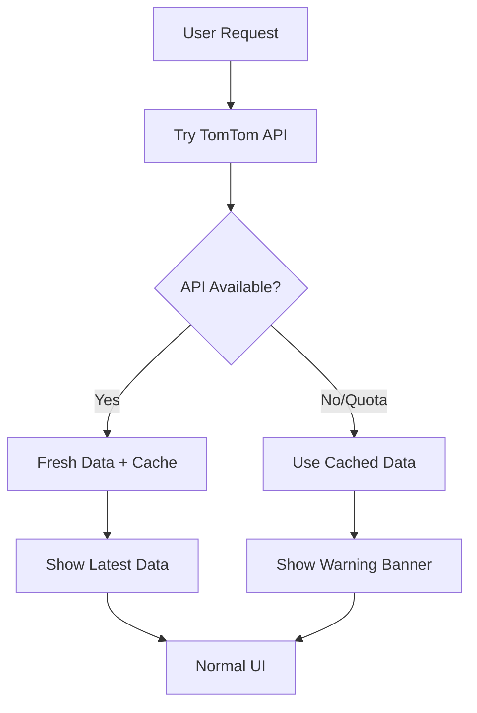

# 🚨 TomTom API Quota Exhausted

Your TomTom API key has run out of free credits. Here are your options:

## 🔑 **Quick Fix: Get New API Key**

1. **Visit TomTom Developer Portal**:
   ```
   https://developer.tomtom.com/
   ```

2. **Create New Account** (use different email if needed)

3. **Generate New API Key**:
   - Go to "My Dashboard" 
   - Click "Create a new API Key"
   - Copy the new key

4. **Update Backend Configuration**:
   ```bash
   # Edit your .env file
   TOMTOM_API_KEY=YOUR_NEW_API_KEY_HERE
   ```

5. **Restart Backend**:
   ```bash
   cd backend
   python -m uvicorn app.main:app --reload --host 0.0.0.0 --port 8000
   ```

## 📊 **Current Behavior (Graceful Fallback)**

✅ **What Works**:
- App continues to function
- Shows cached station data
- User sees clear warning banner
- All premium features still work
- Favorite station visualization still shows historical data

✅ **User Experience**:
- Yellow warning banner appears
- "Using Cached Data" message
- Shows number of cached stations
- No app crashes or errors

## 🏗️ **Architecture Enhancement**

The application now includes **graceful API failure handling**:



## 💰 **Free Tier Limits**

- **Search API**: ~2,500 requests/month
- **Resets**: Monthly on subscription date
- **Heavy Usage**: Batch updates + real-time polling consume quota quickly

## 🔄 **Alternative Solutions**

1. **Multiple API Keys**: Rotate between different keys
2. **Reduce Polling**: Increase batch update intervals
3. **Paid Plan**: Upgrade to TomTom paid tier
4. **Mock Data**: Use static test data for development

## 🎯 **Next Steps**

1. Get new API key (immediate fix)
2. Consider implementing key rotation
3. Monitor usage more carefully
4. Optimize batch update frequency

The app is designed to handle this gracefully, so users won't experience service interruption! 🚀 